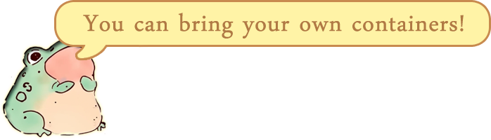
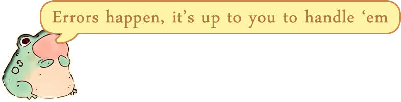

<p align="center">
    
    
    
    
</p>

<p align="center">
    
</p>

Hexi is a lightweight, header-only C++23 library for safely handling binary data from arbitrary sources (but primarily network data). It sits somewhere between manually memcpying bytes from network buffers and full-blown serialisation libraries.

Some of the protocols Hexi is used to handle include [DNS](https://en.wikipedia.org/wiki/Domain_Name_System), [STUN](https://en.wikipedia.org/wiki/STUN), [NAT Port Mapping Protocol](https://en.wikipedia.org/wiki/NAT_Port_Mapping_Protocol), [Port Control Protocol](https://en.wikipedia.org/wiki/Port_Control_Protocol), World of Warcraft (emulators) and GameSpy (emulators). Of course, nothing stops you from defining your own! 

The design goals are ease of use, safety when dealing with untrusted data and in the face of programmer mistakes, a reasonable level of flexibility, and keeping overhead to a minimum.

What Hexi doesn't offer: versioning, conversion between different formats, handling of text-based formats, unloading the dishwasher.

Hexi is dual-licensed under MIT and Apache License, Version 2.0. This means you can use Hexi under the license you prefer.


Incorporating Hexi into your project is simple! The easiest way is to simply copy `hexi.h` from `single_include` into your own project. If you'd rather only include what you use, you can add `include` to your include paths or incorporate it into your own CMake project with `target_link_library`. To build the unit tests, run CMake with `ENABLE_TESTING`.

Here's what some libraries might call a very simple motivating example:

```cpp
#include <hexi.h>
#include <array>
#include <vector>
#include <cstddef>

struct UserPacket {
    uint64_t user_id;
    uint64_t timestamp;
    std::array<uint8_t, 16> ipv6;
};

auto deserialise(std::span<const char> network_buffer) {
    hexi::buffer_adaptor adaptor(network_buffer); // wrap the buffer
    hexi::binary_stream stream(adaptor);          // create a binary stream
    
    // deserialise!
    UserPacket packet;
    stream >> packet;
    return packet;
}

auto serialise(const UserPacket& packet) {
    std::vector<uint8_t> buffer;
    hexi::buffer_adaptor adaptor(buffer); // wrap the buffer
    hexi::binary_stream stream(adaptor);  // create a binary stream
    
    // serialise!
    stream << packet;
    return buffer;
}
```
By default, Hexi will try to serialise basic structures such as our `UserPacket` if they meet requirements for being safe to directly copy the bytes. Now, for reasons of portability, it's not recommended that you do things this way unless you're positive that the data layout is identical on the system that wrote the data. Not to worry, this is easily solved. Plus, we didn't do any error or endianness handling. All in good time.


The two classes you'll primarily deal with are `buffer_adaptor` and `binary_stream`.

`binary_stream` takes a container as its argument and is used to do the reading and writing. It doesn't know much about the details of the underlying container.

To support containers that weren't written to be used with Hexi, `buffer_adaptor` is used as a wrapper that `binary_stream` can interface with. As with `binary_stream`, it also provides read and write operations but at a lower level. 

`buffer_adaptor` can wrap any contiguous container or view that provides `data` and `size` member functions and optionally `resize()` for write support. From the standard library, that means the following can be used out of the box:
- [x] std::array
- [x] std::span
- [x] std::string_view
- [x] std::string
- [x] std::vector

Plenty of non-standard library containers will work out of the box, too, as long as they provide a vaguely similar API.

The container's value type must be a byte type (e.g. `char`, `std::byte`, `uint8_t`). `std::as_bytes` can be used as a workaround if this poses a problem.



Hexi supports custom containers, including non-contiguous containers. In fact, there's a non-contiguous container included in the library. You simply need to provide a few functions such as `read` and `size` to allow the `binary_stream` class to be able to use it. 

`static_buffer.h` provides a simple example of a custom container that can be used directly with `binary_stream`.


As mentioned, Hexi is intended to be safe to use even when dealing with untrusted data. An example might be network messages that have been manipulated to try to trick your code into reading out of bounds.

`binary_stream` performs bounds checking to ensure that it will never read more data than the buffer has available and optionally allows you to specify an upper bound on the amount of data to read. This can be useful when you have multiple messages in a buffer and want to limit the deserialisation from potentially eating into the next.

```cpp
buffer_t buffer;
// ... read data
hexi::binary_stream stream(buffer, 32); // will never read more than 32 bytes
```



The default error handling mechanism is exceptions. Upon encountering a problem with reading data, an exception derived from `hexi::exception` will be thrown. These are:

- `hexi::buffer_underrun` - attempt to read out of bounds
- `hexi::stream_read_limit` - attempt to read more than the imposed limit

Exceptions from `binary_stream` can be disabled by specifying `no_throw` as an argument. This argument eliminates exception branches at compile-time, so there's zero run-time overhead.
```cpp
hexi::binary_stream stream(buffer, hexi::no_throw);
```
Regardless of the error handling mechanism you use, the state of a `binary_stream` can be checked as follows:
```cpp
hexi::binary_stream stream(buffer, hexi::no_throw);
// ... assume an error happens

// simplest way to check whether any errors have occurred
if (!stream) {
    // handle error
}

// or we can get the state
if (auto state = stream.state(); state != hexi::stream_state::ok) {
    // handle error
}
```


In the first example, reading our `UserPacket` would only work as expected if the program that wrote the data laid everything out in the same way as our own program.
This might not be the case for reasons of architecture differences, compiler flags, etc. 

Here's the same example but doing it portably.
```cpp
#include <hexi.h>
#include <span>
#include <string>
#include <vector>
#include <cstddef>
#include <cstdint>

struct UserPacket {
    uint64_t user_id;
    std::string username;
    uint64_t timestamp;
    uint8_t has_optional_field;
    uint32_t optional_field;  // pretend this is big-endian in the protocol

    // deserialise
    auto& operator>>(auto& stream) {
        stream >> user_id >> username >> timestamp >> has_optional_field;

        if (has_optional_field) {
            // fetch explicitly as big-endian value
            stream >> hexi::endian::from_big(optional_field);
        }

        // we can manually trigger an error if something went wrong
        // stream.set_error_state();
        return stream;
    }

    // serialise
    auto& operator<<(auto& stream) const {
        stream << user_id << username << timestamp << has_optional_field;

        if (has_optional_field) {
            // write explicitly as big-endian value
            stream << hexi::endian::to_big(optional_field);
        }

        return stream;
    }
};

// pretend we're reading network data
void read() {
    std::vector<char> buffer;
    const auto bytes_read = socket.read(buffer);

    // ... logic for determining packet type, etc

    bool result {};

    switch (packet_type) {
        case packet_type::user_packet:
            result = handle_user_packet(buffer);
            break;
    }

    // ... handle result
}

auto handle_user_packet(std::span<const char> buffer) {
    hexi::buffer_adaptor adaptor(buffer);

    /**
     * hexi::endian::little tells the stream to convert to/from
     * little-endian unless told otherwise by using the endian
     * adaptors. If no argument is provided, it does not perform
     * any conversions by default.
     */
    hexi::binary_stream stream(adaptor, hexi::endian::little);

    UserPacket packet;
    stream >> packet;

    if (stream) {
        // ... do something with the packet
        return true;
    } else {
        return false;
    }
}
```

This example is fully portable and is even independent of the platform byte order. By specifying the endianness of the stream, it'll automagically convert all endian-sensitive data to the requested byte order.
The default argument is `hexi::endian::native`, which will perform no conversions, while `hexi::endian::big` and `hexi::endian::little` will perform conversions if required.

If your protocol contains mixed endianness, you can use the endian adaptors to specify the desired byte order when streaming
the data, as shown in the above example. 

Best of all, because this is handled by templates, there is zero runtime cost if no conversion is required
(i.e. the native byte order matches the requested byte order) and constant values can be converted
at compile-time. For example, specifying `hexi::endian::little` on a little-endian platform will generate zero
code. 

`docs/examples/endian.cpp` provides examples for byte order handling functionality.

As for the serialisation functions, if you want the function bodies to be in a source file, it's recommended that you provide your own `using` alias for your `binary_stream` type.
The alternative is to use the polymorphic equivalents, `pmc::buffer_adaptor` and `pmc::binary_stream`, which allow you to change the underlying buffer type at runtime but at the potential cost of virtual call overhead (devirtualisation not withstanding) and lacking some functionality that doesn't mesh well with polymorphism.

How you structure your code is up to you, this is just one way of doing it.


Handling strings need a little thought. `std::string` and `std::string_view` are allowed to contain embedded nulls, even if it's rarely done.

To adhere to the principle of least surprise, Hexi defaults to reading & writing these types with a length prefix. This ensures that writing
such a string and reading it back will give you the correct result regardless of the contents.

In the majority of cases, you'll want to read/write strings as null-terminated. To do this, use a string adaptor, as such:

```cpp
hexi::binary_stream stream(...);
std::string foo { "No surprises here!" };

// write it
stream << hexi::null_terminated(foo);

// read it back
stream >> hexi::null_terminated(foo);
```

This is not the default because writing strings that may contain embedded null bytes would result in a truncated string on reading back. This is Hexi's way of making you pinky promise that you're doing the right thing for your string data.

`const char*` strings are *always* written as null-terminated strings, as embedded nulls in such a type would make little sense. Read them back with the `null_terminated` adaptor.

Other adaptors, such as `prefixed_varint`, are available. See `docs/examples/string_handling.cpp` for usage examples.


Here's a very quick rundown on some of the included extras.
- `hexi::file_buffer`
    - For dealing with binary files. Simples.
- `hexi::static_buffer`
    - Fixed-size networking buffer for when you know the upper bound on the amount of data you'll need to send or receive in one go. Essentially a wrapper around `std::array` but with added state tracking. Handy if you need to deserialise in multiple steps (read packet header, dispatch, read packet body).
- `hexi::dynamic_buffer`
    - Resizeable buffer for when you want to deal with occasional large reads/writes without having to allocate the space up front. Internally, it adds additional allocations to accommodate extra data rather than requesting a larger allocation and copying data as `std::vector` would. It reuses allocated blocks where possible and has support for Asio (Boost or standalone). Effectively, it's a linked list buffer.
- `hexi::tls_block_allocator`
    - Allows many instances of `dynamic_buffer` to share a larger pool of pre-allocated memory, with each thread having its own pool. This is useful when you have many network sockets to handle and want to avoid the general purpose allocator. The caveat is that a deallocation must be made by the same thread that made the allocation, thus limiting access to the buffer to a single thread (with some exceptions).
- `hexi::endian`
    - Provides functionality for handling endianness of integral types.
- `hexi::null_buffer`
    - Hexi's equivalent of /dev/null. This buffer is useful if you want to know what the exact size of a type will be after
    serialisation, typically for allocating or reserving an exact amount of memory. Running serialisation twice might sound
    inefficient, but compilers can often calculate the end result of serialising to `null_buffer` at compile-time, or distill
    it down to a few instructions of arithmetic.


We're at the end of the overview, but there's more to discover if you decide to give Hexi a shot. Here's a selection of tasty morsels:

- `binary_stream` allows you to perform write seeking within the stream, when the underlying buffer supports it. This is nice if, for example, you need to update a message header with information that you might not know until the rest of the message has been written; checksums, sizes, etc.
- `binary_stream` provides overloaded `put` and `get` member functions, which allow for fine-grained control, such as reading/writing a specific number of bytes.
- `binary_stream` allows for deserialising to `std::string_view` and `std::span` with `view()` and `span()` as long as the underlying container is contiguous. This allows you to create views into the buffer's data, providing a fast, zero-copy way to read strings and arrays from the stream. If you do this, you should avoid writing to the same buffer while holding views to the data.
- `buffer_adaptor` provides a template option, `space_optimise`. This is enabled by default and allows it to avoid resizing containers in cases where all data has been read by the stream. Disabling it allows for preserving data even after having been read. This option is only relevant in scenarios where a single buffer is being both written to and read from.
- `buffer_adaptor` provides `find_first_of`, making it easy to find a specific sentinel value within your buffer.

To learn more, check out the examples in `docs/examples`!


